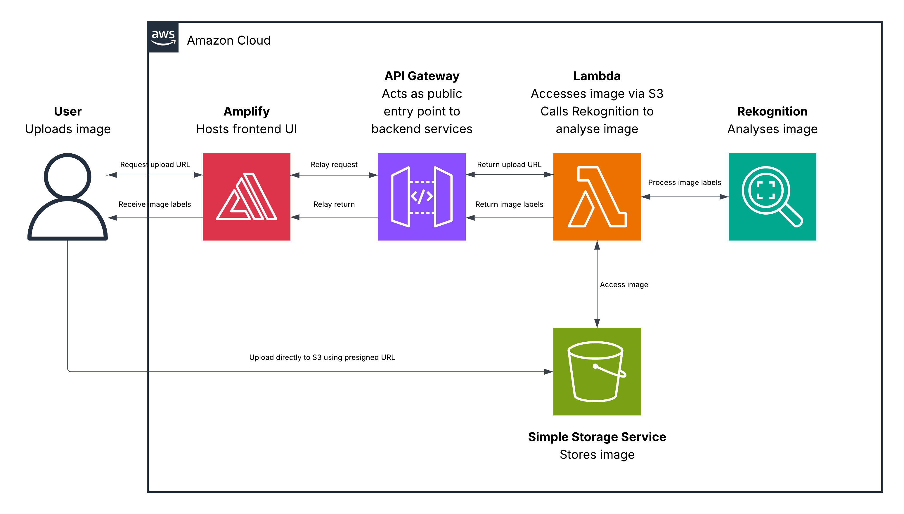

# AI Image Label Generator

A fully serverless image analysis application built on AWS that allows users to upload images and automatically identify objects, animals, scenes, and other visual content using Amazon Rekognition. Images are uploaded directly to Amazon S3 using presigned URLs, with the frontend deployed using AWS Amplify.

## Live Demo

https://staging.d3w1w0m6iehn9k.amplifyapp.com/

## Architecture

## Overview

This project implements a fully serverless image recognition system without requiring any server management.

## AWS Services Used

- AWS Amplify – Frontend hosting and deployment
- Amazon API Gateway – REST API endpoint for requests
- AWS Lambda – Backend logic and image processing
- Amazon S3 – Image storage and presigned URL uploads
- Amazon Rekognition – AI-powered image analysis and label detection

When a user uploads an image:

1. The frontend requests a presigned upload URL from API Gateway
2. API Gateway triggers a Lambda function
3. Lambda generates a temporary upload URL for Amazon S3
4. The browser uploads the image directly to S3
5. The frontend sends the uploaded image key to Lambda
6. Lambda calls Amazon Rekognition to analyse the image
7. Rekognition returns detected labels and confidence scores
8. The frontend displays the results to the user

## Design Decisions

- Serverless-first architecture to eliminate server management
- Direct-to-S3 uploads using presigned URLs to improve scalability and reduce Lambda processing overhead
- Amazon Rekognition for managed AI-powered image analysis
- API Gateway as a secure public-facing endpoint
- AWS Amplify for simple frontend deployment and hosting

## Key Learnings

- Designing serverless architectures using AWS services
- Generating and using S3 presigned URLs
- Building direct browser-to-S3 upload workflows
- Integrating Amazon Rekognition into serverless applications
- API Gateway and Lambda integration patterns
- Troubleshooting CORS and regional endpoint configuration issues
- Frontend deployment with AWS Amplify

---

## Summary

This project demonstrates a serverless image analysis application built using AWS managed services. It focuses on image upload workflows, AI-powered object recognition, and helping me gain hands-on experience with cloud architecture, storage, serverless computing, and machine learning services.

## Contact

Open to internship and graduate opportunities in software engineering and cloud computing.

- Email: nevenspooner03@gmail.com
- LinkedIn: https://www.linkedin.com/in/neven-spooner/
